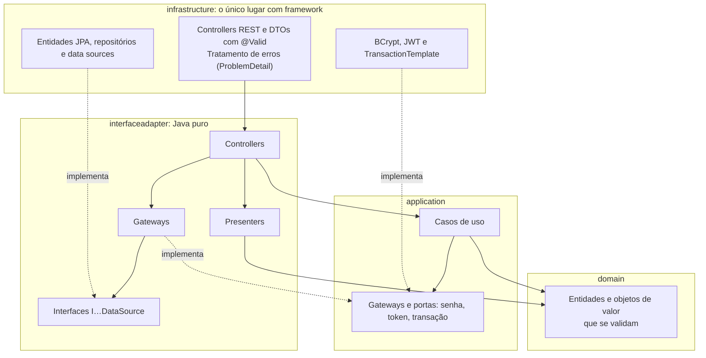
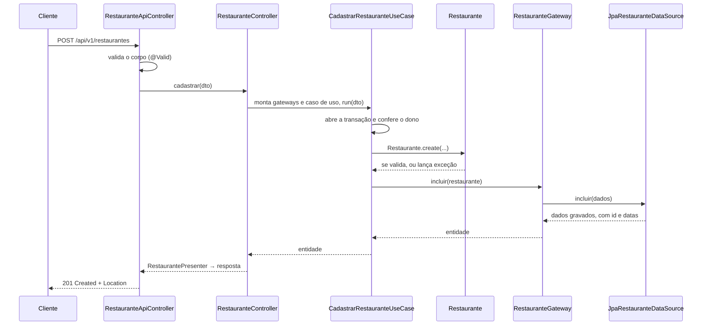
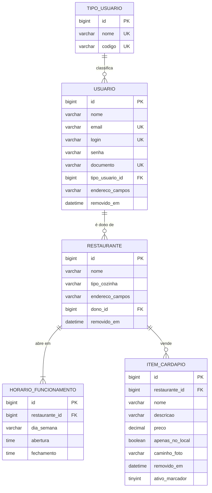

# API de Gestão de Restaurantes

[](https://github.com/ThiagoWippel/fiap-adj-tech-challenge-fase-2/actions/workflows/ci.yml)

Backend do sistema compartilhado de gestão para restaurantes.
**Tech Challenge · Fase 2 · Pós Tech FIAP · Arquitetura e Desenvolvimento em Java**

A Fase 2 continua a Fase 1 (cadastro de usuários e login) em Clean Architecture e acrescenta os três
cadastros do enunciado: tipos de usuário, restaurantes e itens do cardápio. A versão avaliada da Fase 1
está na tag [`fase-1-entregue`](https://github.com/ThiagoWippel/fiap-adj-tech-challenge-fase-2/tree/fase-1-entregue).

---

## Avaliação rápida

Para subir tudo e rodar a collection inteira (precisa de Docker e, para o Newman, de Node):

```bash
cp .env.example .env
docker compose up -d --build --wait
npx newman run postman/tech-challenge-fase-2.postman_collection.json -e postman/Local.postman_environment.json
```

Com a aplicação no ar, o Swagger fica em http://localhost:8080/swagger-ui.html.

| Critério do enunciado | Onde verificar |
|---|---|
| 1 · Funcionalidade | [Endpoints](#endpoints): 26 rotas, as 8 da Fase 1 e 18 novas · testes em `src/test/.../infrastructure/api` |
| 2 · Qualidade do código | [Arquitetura](#arquitetura), Javadoc em todas as classes públicas, [decisões](#decisões-principais) |
| 3 · Documentação | Este README · Swagger com exemplos de sucesso e de erro em cada rota · [`docs/openapi.json`](docs/openapi.json) |
| 4 · Collections | [`postman/`](postman/): 83 requisições com verificações, rodadas pelo CI a cada push |
| 5 · Docker Compose | [`docker-compose.yml`](docker-compose.yml): aplicação e MySQL, os dois com healthcheck |
| 6 · Repositório | Este repositório, público, com o histórico da Fase 1 |
| 7 · Clean Architecture | Pacotes `domain`, `application`, `interfaceadapter` e `infrastructure`, com as regras de dependência testadas pelo ArchUnit |
| 8 · Testes | 80% de cobertura exigida em dois cortes que travam o build; integração contra MySQL real ([Testes](#testes)) |
| 9 · Vídeo | Entregue com o relatório |

Cada requisito leva a um cenário do [catálogo](docs/catalogo-de-cenarios.md), e cada cenário leva ao teste que
o comprova: está tudo na [matriz requisito → evidência](docs/matriz-de-evidencias.md).

## Índice

- [Avaliação rápida](#avaliação-rápida)
- [O que o sistema faz](#o-que-o-sistema-faz)
- [Como executar](#como-executar)
- [Endpoints](#endpoints)
- [Arquitetura](#arquitetura)
- [Modelo de dados](#modelo-de-dados)
- [Decisões principais](#decisões-principais)
- [Testes](#testes)
- [Collection do Postman](#collection-do-postman)
- [Solução de problemas](#solução-de-problemas)

---

## O que o sistema faz

- **Usuários** (Fase 1): cadastro, consulta, busca por nome (v1 em lista, v2 paginada), atualização, troca
  de senha em endpoint próprio, exclusão e login. O login devolve um JWT assinado.
- **Tipos de usuário**: CRUD com o nome; o código é gerado a partir dele ("Ajudante de Cozinha" vira
  `AJUDANTE_DE_COZINHA`) e nunca muda. Cliente e Dono de Restaurante são tipos de sistema: podem ser
  renomeados, não excluídos. Um usuário troca de tipo na mesma conta, informando o documento do novo tipo.
- **Restaurantes**: nome, endereço, tipo de cozinha (lista fechada), horários e dono. O dono precisa ser do
  tipo Dono de Restaurante. Os horários são turnos por dia da semana; um turno pode passar da meia-noite
  (sexta 18:00–02:00) e os turnos não podem se sobrepor.
- **Itens do cardápio**: nas rotas do restaurante. Nome único entre os itens ativos do restaurante, preço com
  no máximo duas casas, disponibilidade só no local e o caminho da foto.

Regras que cruzam os cadastros:

- Dono de Restaurante usa CNPJ; os demais tipos usam CPF, com os dígitos verificadores conferidos.
- Quem tem restaurante ativo não pode ser excluído nem deixar de ser Dono de Restaurante.
- A exclusão depende da natureza do dado: o usuário é anonimizado, restaurante e item têm exclusão lógica, e
  o tipo de usuário é excluído de verdade, se nenhum usuário ativo o usar.

## Como executar

### Pré-requisitos

- Docker com o Compose v2 (`docker compose version`).
- Para rodar os testes: Java 21. O Maven vem no projeto (`./mvnw`) e os testes de integração sobem o próprio
  MySQL com o Testcontainers, então o Docker também precisa estar no ar.
- Para rodar a collection pelo terminal: Node, para o `npx newman`.

### Passo a passo

**1. Clonar**

```bash
git clone https://github.com/ThiagoWippel/fiap-adj-tech-challenge-fase-2.git
cd fiap-adj-tech-challenge-fase-2
```

**2. Criar o `.env`**

```bash
cp .env.example .env
```

O `.env.example` já funciona como está. Para uso real, troque as senhas e a `JWT_CHAVE`
(`openssl rand -base64 32` gera uma).

**3. Subir**

```bash
docker compose up -d --build --wait
```

O `--wait` só devolve o terminal quando o banco e a aplicação passam no healthcheck. A primeira execução
baixa as imagens e compila o projeto, e leva alguns minutos.

**4. Conferir**

| Recurso | Endereço |
|---|---|
| Swagger | http://localhost:8080/swagger-ui.html |
| Especificação OpenAPI | http://localhost:8080/v3/api-docs |
| Saúde da aplicação | http://localhost:8080/actuator/health |
| Tipos de problema dos erros | http://localhost:8080/problemas |
| Banco, para ferramentas externas | `localhost:3307` |

### Variáveis de ambiente

Ficam no `.env`, que não é versionado; o `.env.example` é o modelo.

| Variável | No exemplo | Para quê |
|---|---|---|
| `DB_NAME` | `restaurante_db` | Banco criado na primeira subida |
| `DB_USER` / `DB_PASSWORD` | `restaurante` / `altere_esta_senha` | Usuário da aplicação no MySQL |
| `DB_ROOT_PASSWORD` | `altere_esta_senha_root` | Senha do root do MySQL |
| `DB_EXTERNAL_PORT` | `3307` | Porta do banco na máquina |
| `APP_PORT` | `8080` | Porta da aplicação na máquina |
| `JWT_CHAVE` | um texto de exemplo | Chave de assinatura do token do login, com ao menos 32 caracteres. Sem ela, a aplicação não sobe e o log diz qual variável falta |

### Encerrar

```bash
docker compose down      # para os contêineres e mantém o banco
docker compose down -v   # apaga também o volume com os dados do banco
```

### Rodar a aplicação fora do Docker

O perfil `dev`, que é o padrão, usa o MySQL do compose e lê o `.env` da raiz:

```bash
docker compose up -d --wait mysql
./mvnw spring-boot:run
```

### Rodar os testes

```bash
./mvnw verify
```

Roda os testes unitários, os de integração (com o MySQL 8.4 do Testcontainers), as regras do ArchUnit e os
cortes de cobertura. Os relatórios do JaCoCo ficam em `target/site/jacoco-unitarios` e
`target/site/jacoco-total`. Só os unitários: `./mvnw test`.

## Endpoints

São 26: as 8 rotas da Fase 1, com o mesmo contrato, e 18 novas. Todas estão no Swagger, com exemplo de sucesso
e de erro.

**Usuários e login**

| Método | Rota | Status | |
|---|---|---|---|
| POST | `/api/v1/usuarios` | 201 · 400 · 404 · 409 | Cadastro. O tipo vai pelo código (`CLIENTE`, `DONO_RESTAURANTE` ou um tipo do CRUD) |
| GET | `/api/v1/usuarios?nome=` | 200 | Busca pelo trecho do nome, em lista |
| GET | `/api/v2/usuarios?nome=` | 200 · 400 | A mesma busca, paginada |
| GET | `/api/v1/usuarios/{id}` | 200 · 404 | |
| PUT | `/api/v1/usuarios/{id}` | 200 · 400 · 404 · 409 | Nome, e-mail, login e endereço |
| PUT | `/api/v1/usuarios/{id}/senha` | 204 · 400 · 401 · 404 | Exige a senha atual |
| PATCH | `/api/v1/usuarios/{id}/tipo` | 200 · 400 · 404 · 409 | Troca de tipo, com o documento do novo tipo |
| GET | `/api/v1/usuarios/{id}/restaurantes` | 200 · 400 · 404 | Restaurantes ativos do usuário |
| DELETE | `/api/v1/usuarios/{id}` | 204 · 404 · 409 | Anonimiza; 409 se tiver restaurante ativo |
| POST | `/api/v1/auth/login` | 200 · 400 · 401 | Devolve id, nome, tipo, `token` e `expiraEm` |

**Tipos de usuário**

| Método | Rota | Status | |
|---|---|---|---|
| POST | `/api/v1/tipos-usuario` | 201 · 400 · 409 | Recebe só o nome |
| GET | `/api/v1/tipos-usuario` | 200 · 400 | |
| GET | `/api/v1/tipos-usuario/{id}` | 200 · 404 | |
| PUT | `/api/v1/tipos-usuario/{id}` | 200 · 400 · 404 · 409 | Renomeia; o código não muda |
| DELETE | `/api/v1/tipos-usuario/{id}` | 204 · 404 · 409 | 409 se for de sistema ou estiver em uso |
| GET | `/api/v1/tipos-usuario/{id}/usuarios` | 200 · 400 · 404 | Usuários ativos do tipo |

**Restaurantes**

| Método | Rota | Status | |
|---|---|---|---|
| POST | `/api/v1/restaurantes` | 201 · 400 · 404 · 409 | 409 se o dono não for Dono de Restaurante |
| GET | `/api/v1/restaurantes?nome=&tipoCozinha=` | 200 · 400 | Filtros opcionais |
| GET | `/api/v1/restaurantes/{id}` | 200 · 404 | |
| PUT | `/api/v1/restaurantes/{id}` | 200 · 400 · 404 · 409 | Substitui os turnos; outro `donoId` transfere o restaurante |
| DELETE | `/api/v1/restaurantes/{id}` | 204 · 404 | Exclusão lógica |

**Itens do cardápio**

| Método | Rota | Status | |
|---|---|---|---|
| POST | `/api/v1/restaurantes/{restauranteId}/itens-cardapio` | 201 · 400 · 404 · 409 | 409 se o nome já for de outro item ativo |
| GET | `/api/v1/restaurantes/{restauranteId}/itens-cardapio?apenasNoLocal=` | 200 · 400 · 404 | |
| GET | `/api/v1/restaurantes/{restauranteId}/itens-cardapio/{itemId}` | 200 · 404 | 404 se o item for de outro restaurante |
| PUT | `/api/v1/restaurantes/{restauranteId}/itens-cardapio/{itemId}` | 200 · 400 · 404 · 409 | |
| DELETE | `/api/v1/restaurantes/{restauranteId}/itens-cardapio/{itemId}` | 204 · 404 | Exclusão lógica |

Exemplo de cadastro de restaurante:

```json
POST /api/v1/restaurantes
{
  "nome": "Cantina da Nona",
  "endereco": { "rua": "Rua Hercílio Luz", "numero": "120", "bairro": "Centro",
                "cidade": "Itajaí", "estado": "SC", "cep": "88301-000" },
  "tipoCozinha": "ITALIANA",
  "donoId": 7,
  "horarios": [
    { "diaSemana": "SEGUNDA", "abertura": "11:00", "fechamento": "15:00" },
    { "diaSemana": "SEGUNDA", "abertura": "18:00", "fechamento": "23:00" },
    { "diaSemana": "SEXTA", "abertura": "18:00", "fechamento": "02:00" }
  ]
}
```

### Listagens

As listagens novas seguem o formato da busca v2 da Fase 1: `conteudo` mais `pagina`, `tamanho`,
`totalElementos`, `totalPaginas` e `ultima`. Aceitam `page`, `size` e `sort`; o padrão é 10 por página, em
ordem de nome, e o `size` vai no máximo a 50. Ordenar por um campo que a resposta não mostra devolve 400.
Registros removidos nunca aparecem.

### Versionamento

A versão faz parte da rota. Mudança compatível, como um campo novo na resposta, fica na versão atual: o
login ganhou `token` e `expiraEm` sem sair da v1. Só a quebra de contrato gera versão nova, como a busca de
usuários da v2, que devolve uma página em vez de uma lista. Recursos novos nascem em v1.

### Erros

Todas as respostas de erro seguem a RFC 9457 (ProblemDetail), inclusive os erros do próprio Spring, como
JSON malformado e rota inexistente:

```json
{
  "type": "http://localhost:8080/problemas/conflito-de-dados",
  "title": "Conflito de dados",
  "status": 409,
  "detail": "O usuário 7 é responsável por 1 restaurante ativo. Transfira ou exclua o restaurante antes de excluir o usuário.",
  "instance": "/api/v1/usuarios/7",
  "momento": "2026-10-08T10:30:00"
}
```

O `type` aponta para a própria aplicação, que descreve o problema em `/problemas/{identificador}`. As falhas
de validação de campo trazem também `erros`, com o campo e a mensagem de cada um.

| Título | Status | Quando |
|---|---|---|
| Dados inválidos | 400 | Campo ausente, fora do formato ou fora das regras |
| Regra de negócio violada | 400 | Regra que envolve mais de um campo, como o documento exigido pelo tipo ou turnos sobrepostos |
| Requisição inválida | 400 | JSON malformado, parâmetro de tipo errado, ordenação por campo não aceito |
| Credenciais inválidas | 401 | Login ou senha incorretos, senha atual incorreta |
| Recurso não encontrado | 404 | Id inexistente ou registro removido |
| Método não permitido | 405 | Verbo que a rota não aceita |
| Conflito de dados | 409 | Unicidade, tipo em uso, dono que não é Dono de Restaurante, restaurante ativo |
| Mídia não suportada | 415 | Corpo que não é JSON |
| Erro interno | 500 | Falha inesperada; o detalhe fica só no log |

### Token

O login emite um JWT assinado (HMAC-SHA256), com o id do usuário no `sub`, o código do tipo e a validade de
uma hora. Nenhum endpoint exige o token nesta fase: o enunciado não define quem pode fazer o quê, e exigir o
token obrigaria a inventar essas regras.

## Arquitetura

O código segue a Clean Architecture do material da disciplina, em quatro pacotes de primeiro nível:



As dependências apontam sempre para dentro. O ArchUnit trava isso no build: o domínio e a aplicação não
dependem de framework, os adaptadores não usam Spring, e nada do núcleo depende da infraestrutura.

```
br.com.fiap.restaurante
├── domain/            entidades (Usuario, TipoUsuario, Restaurante, ItemCardapio), objetos de valor
│                      (Endereco, Documento, Turno, QuadroDeHorarios, Preco), enums e exceções
├── application/       casos de uso (um por operação), interfaces de gateway, portas, DTOs e exceções
├── interfaceadapter/  controllers puros, gateways, presenters e as interfaces I…DataSource
└── infrastructure/    REST, persistência JPA, segurança, transação, configuração e tratamento de erros
```

O caminho de um cadastro de restaurante:



O material não resolve alguns problemas que a Clean Architecture cria, e cada um ganhou uma solução própria:
- a transação virou a porta `ITransactionManager`, implementada com `TransactionTemplate`;
- a senha e o token também viraram portas (`IPasswordEncoder`, `ITokenGenerator`);
- as datas de auditoria ficam na infraestrutura e voltam ao domínio pela fábrica com id;
- o data source atualiza a entidade carregada do banco, para não perder a data de criação;
- os DTOs de requisição conferem formato e presença, e as entidades conferem as regras.

## Modelo de dados



Usuário, restaurante e item têm `data_criacao` e `data_ultima_alteracao`, preenchidas pela auditoria do Spring
Data. O schema vem do script [`docker/mysql/init/01-schema.sql`](docker/mysql/init/01-schema.sql); o Hibernate
só confere o mapeamento.

- As tabelas usam `utf8mb4_unicode_ci`, que compara sem diferenciar maiúsculas, acentos e espaço no fim. É o
  que faz `Maria@Exemplo.com` colidir com `maria@exemplo.com`.
- Uma regra `CHECK` exige todos os dados de um usuário ativo. As colunas aceitam nulo só por causa da
  anonimização.
- `ativo_marcador` é gerada pelo próprio MySQL: vale 1 para o item ativo e fica nula quando ele é removido.
  Na restrição única `(restaurante_id, nome, ativo_marcador)`, itens removidos nunca colidem.
- As chaves estrangeiras bloqueiam a exclusão do pai; só os turnos saem em cascata com o restaurante.
- Os índices de `dono_id`, `tipo_cozinha`, `restaurante_id` e `tipo_usuario_id` atendem as consultas da
  aplicação. O [EXPLAIN antes e depois dos índices](docs/explain.md) mostra o ganho em cada uma.

## Decisões principais

- **MySQL em todo lugar.** O H2 da Fase 1 saiu: os testes de integração usam o MySQL 8.4 do Testcontainers, com
  o mesmo script do compose. Regras como a colação e a coluna gerada só existem no MySQL.
- **Exclusão conforme a natureza do dado.** Usuário é dado pessoal: é anonimizado, com base na LGPD, e o e-mail,
  o login e o documento ficam livres para um novo cadastro. Restaurante e item são dados de negócio, que
  pedidos e avaliações das próximas fases vão referenciar: exclusão lógica. Tipo de usuário é referência:
  exclusão física, bloqueada se estiver em uso.
- **Tipo de usuário é tabela; tipo de cozinha é enum.** Vira tabela o que o negócio precisa gerenciar com o
  sistema rodando; fica enum o que só muda junto com o código.
- **Os tipos de sistema são reconhecidos pelo código, não pelo nome.** Por isso podem ser renomeados, e a troca
  de tipo acontece na mesma conta.
- **Horários como turnos.** Cada turno vira um intervalo em minutos da semana, comparado como num relógio que dá
  a volta, para encontrar sobreposição até na passagem de domingo para segunda.
- **Contrato da Fase 1 preservado.** A collection da Fase 1 roda contra a Fase 2 com três ajustes, descritos na
  própria collection.
- **Desempenho.** Associações LAZY, sem sessão aberta durante a serialização, e a listagem de restaurantes com
  um número fixo de consultas, qualquer que seja o tamanho da página (há um teste que conta).

## Testes

```bash
./mvnw verify
```

| Nível | Ferramenta | O que cobre |
|---|---|---|
| Unitário | JUnit 6, AssertJ, Mockito | Entidades, objetos de valor, casos de uso (com mocks), gateways, presenters e controllers |
| Integração | Testcontainers (MySQL 8.4), `@SpringBootTest`, REST-Assured | Endpoints, formato dos erros, mapeamento, consultas e restrições do banco |
| Arquitetura | ArchUnit | Direção das dependências entre as camadas |
| Aceitação | Postman + Newman | A collection inteira contra o docker compose |

- **Cobertura:** dois cortes travam o build, cada um com 80% de linhas e de ramos: o dos testes unitários sobre
  o núcleo (`domain`, `application` e `interfaceadapter`) e o total. Hoje o núcleo está em 100% e o total acima
  de 99%.
- **Catálogo de cenários:** os 175 cenários de [`docs/catalogo-de-cenarios.md`](docs/catalogo-de-cenarios.md)
  foram escritos antes do código. O ID de cada um aparece no nome do teste que o comprova, na descrição da
  requisição da collection e na [matriz](docs/matriz-de-evidencias.md).
- **TDD:** no histórico do git, o commit dos testes de cada parte vem antes do commit da implementação.
- **CI:** a cada push, o GitHub Actions roda dois jobs. Um executa o `mvn verify`; o outro sobe o docker compose
  a partir do `.env.example` e roda a collection duas vezes seguidas com o Newman.

## Collection do Postman

[`postman/tech-challenge-fase-2.postman_collection.json`](postman/tech-challenge-fase-2.postman_collection.json),
com o ambiente `Local`:

- Pastas 1 a 8: a collection da Fase 1, rodando contra a Fase 2.
- Pastas 9 em diante: tipos de usuário, troca de tipo, restaurantes e itens do cardápio.

Cada requisição tem verificações e cita os cenários do catálogo que cobre. Cada bloco cria os próprios dados
e os exclui no fim, então a collection pode rodar quantas vezes for preciso.

No Postman: importe a collection e o ambiente e rode no Runner, na ordem. Pelo terminal:

```bash
npx newman run postman/tech-challenge-fase-2.postman_collection.json -e postman/Local.postman_environment.json
```

## Solução de problemas

### A aplicação não sobe e o log pede a `JWT_CHAVE`

```
Defina a variável de ambiente JWT_CHAVE com a chave de assinatura do token.
```

O `.env` não tem a chave, ou ela tem menos de 32 caracteres. Copie a linha `JWT_CHAVE` do `.env.example`, ou
gere uma com `openssl rand -base64 32`, e suba de novo.

### Mudanças no schema não aparecem

O MySQL só executa o script de `docker/mysql/init` na primeira subida, com o volume vazio. Depois de atualizar
o projeto:

```bash
docker compose down -v
docker compose up -d --build --wait
```

O `down -v` apaga os dados do banco.

### `Permission denied` ao ler o script do schema

O processo do MySQL dentro do contêiner roda com outro usuário e precisa ler o arquivo:

```bash
chmod 644 docker/mysql/init/*.sql
docker compose down -v
docker compose up -d --build --wait
```

### `address already in use` na porta 8080 ou 3307

Outro processo usa a porta, muitas vezes uma execução local com `./mvnw spring-boot:run`. Veja qual é com
`lsof -i :8080` e encerre o processo, ou troque `APP_PORT` ou `DB_EXTERNAL_PORT` no `.env`.

---

## Autor

**Thiago Wippel Chaves** · RM375015
Pós Tech FIAP · Arquitetura e Desenvolvimento em Java · Fase 2
